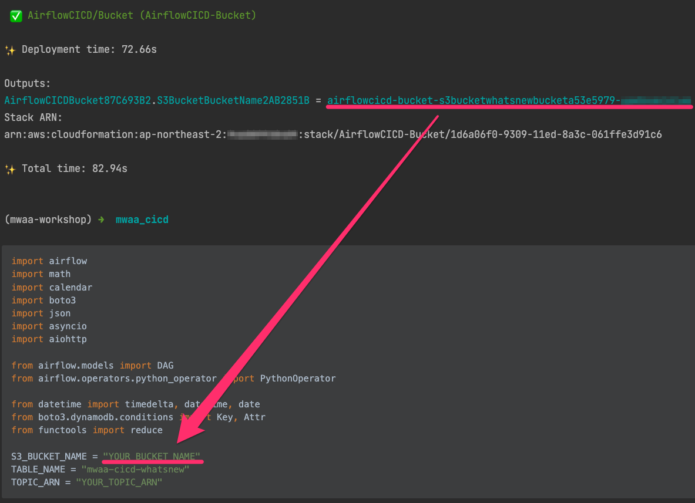

# MWAA Workshop
This example shows how to create CI/CD pipeline for Airflow DAGs


## Prerequisites
- Make sure you have [AWS CLI](https://docs.aws.amazon.com/cli/latest/userguide/install-cliv2.html) installed and configured with an aws account you want to use.

### install cdk
```shell
npm install -g aws-cdk
cdk --version
```

### create virtualenv
```shell
python3 -m venv .venv
source .venv/bin/activate
```

### install requirements
```shell
pip install -r requirements.txt
```

### setting AWS_PROFILE
```shell
export AWS_PROFILE=<the configuration profile for aws-cli>
```

# How to deploy

## Step 1. Create Bucket 
```shell
cdk deploy AirflowCICD/Bucket
```
after the bucket created, do follows.
1) copy the bucket name from the cdk output, and replace YOUR_BUCKET_NAME with it in the **resources/dags/collect_whats_new_weekly.py**



2) go to S3 console and create **dags** and **requirements** folder in the bucket and upload **resources/requirements.txt** into requirements folder.


3) copy requirements.txt version string, then set shell variable like below.
 


```shell
export REQUIREMENTS_S3_OBJ_VER=the_version_stirng_you_copied
```

## Step 2. Create VPC
```shell
cdk deploy AirflowCICD/Network
```


## Step 3. Create MWAA
```shell
cdk deploy AirflowCICD/MWAA
```

after the deployment completed, do follows.
1) copy the topic arn from the cdk output, and replace YOUR_TOPIC_ARN with it in the **resources/dags/collect_whats_new_weekly.py**


2) SNS Topic Subscription - set subscription for Email. the confirmation is needed.


## Step 4. Create CI/CD Pipeline
```shell
cdk deploy AirflowCICD/CICD
```

1) copy the git clone url from the cdk output, and execute the command to clone,
there are three different ways to clone git, choose one that you prefer. In this example, HTTPS way will be used.


2) push source code into the repo

```shell
cd airflow_dags
mkdir dags
cp rsources/dags/collect_whats_new_weekly.py dags/
git status
git add .
git commit -m "initial commit"
git push
```

3) check pipeline


## Step 5. Check Airflow UI and Email 

Go to MWAA Console and Open Airflow UI


Execute whatsnew DAG. To execute the DAG, toggle the pause button.


Check an Email after the execution completed. 


